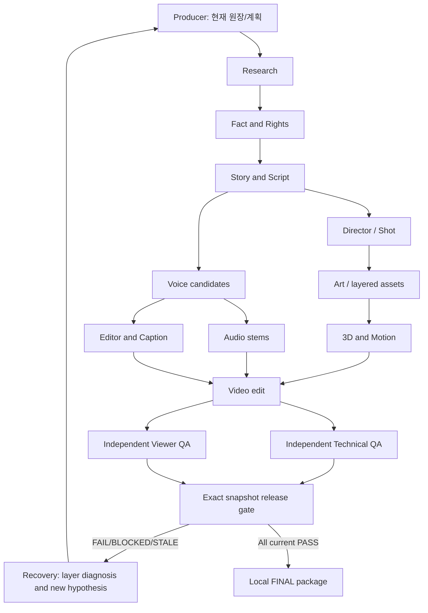

# 아키텍처

## 실행 계층

- `model.py`: 단계 DAG·캐시 서명·brief/Shot 검사.
- `store.py`: 잠금·원자적 상태·불변 파일/메타데이터·JSONL 로그·실패 기록.
- `gates.py`: 관찰·독립 검수·현재 스냅샷·모든 게이트·fixture 금지·원자적 패키징.
- `adapters.py`: 셸 없이 로컬 FFmpeg/FFprobe/say/Blender 실행, 레이어 합성. 임의 외부 API 자동 호출 없음.
- `pipeline.py`: 기술fixture·resume·부분 복구 계획·역할 프롬프트 인계.
- `capabilities.py`: 실제 바이너리 버전·한국어 후보·GPU·남은 공간·연결 상태.
- `editor.py`: JSON 자막 검증/SRT 출력·스템 믹스. 의미상 중복과 직접 청취는 독립 검수.
- `cli.py`: 각 모듈을 조합하는 명령. 거대한 단일 제작 스크립트 없음.

단계 산출물은 파일로 전달한다. 컨텍스트는 원장+artifact metadata+skill/role 계약에서 복원한다. 누락된 입력은 ingest를 차단한다. 다중 파일은 해시가 고정된 ZIP 번들로 등록한다. 현재 구현은 범용 자동 창작 에이전트가 아니라 실제 로컬 도구를 연결한 파일 기반 운영 하네스이다. 의사결정/검수는 역할을 실제 호출한 세션 또는 사람이 담당한다.

## 권한과 상태

네이티브 역할 TOML은 모델을 지정하지 않아 상속한다. read-only 자식만 정의하며 작성은 부모가 수행한다. 기존 로그인으로 Research 실제 spawn/자식 완료를 검증했다. 기본 모델 계정 미지원 및 ephemeral 자식 오류를 보존하고 호출별 gpt-5.6-sol 일반 세션으로 성공했다. 나머지 13개는 TOML 파싱/계약 검사 완료이며 개별 호출은 미실행이다. 전역 계정/승인/샌드박스/훅 설정을 수정하지 않았다.

상태는 실행 SUCCESS/FAILED, 산출물 CURRENT/MISSING/STALE, 품질 PASS/FAIL/BLOCKED로 분리한다. QA 보고서는 현재 전체 스냅샷에 고정된다. local operator의 QA 선언을 신뢰하며 자동 인간 관찰 증명은 제공하지 않는다. 파일이 변경되거나 입력 버전이 달라지면 freshness가 STALE을 반환한다.

## 재사용 근거

실제 개인 `ai-agent-architect/SKILL.md`와 `remotion-best-practices/SKILL.md`, 후자의 ffmpeg/subtitles 규칙을 읽었다. 인터뷰 절차는 이미 구체적인 사용자 구축 지시가 있어 추가 인터뷰 대신 해당 요구사항을 적용했다. Remotion 런타임은 설치하지 않고 프레임 타이밍·JSON 자막·실제 도구 점검 원칙을 재사용했다. 기존 video-producer/reviewer/researcher TOML을 읽었으나 긴 원본 영상에서 10개 숏폼 자동 변환 같은 기존 지침은 이번 작업에 맞지 않아 그대로 적용하지 않았다.

네이티브 TOML 정의 근거: [공식 Codex 서브에이전트 문서](https://learn.chatgpt.com/docs/agent-configuration/subagents). 역할 파일만으로 자동 실행되지는 않는다. 글로벌 레지스트리 통합은 대기 중이며 프로젝트 레지스트리만 생성했다.
